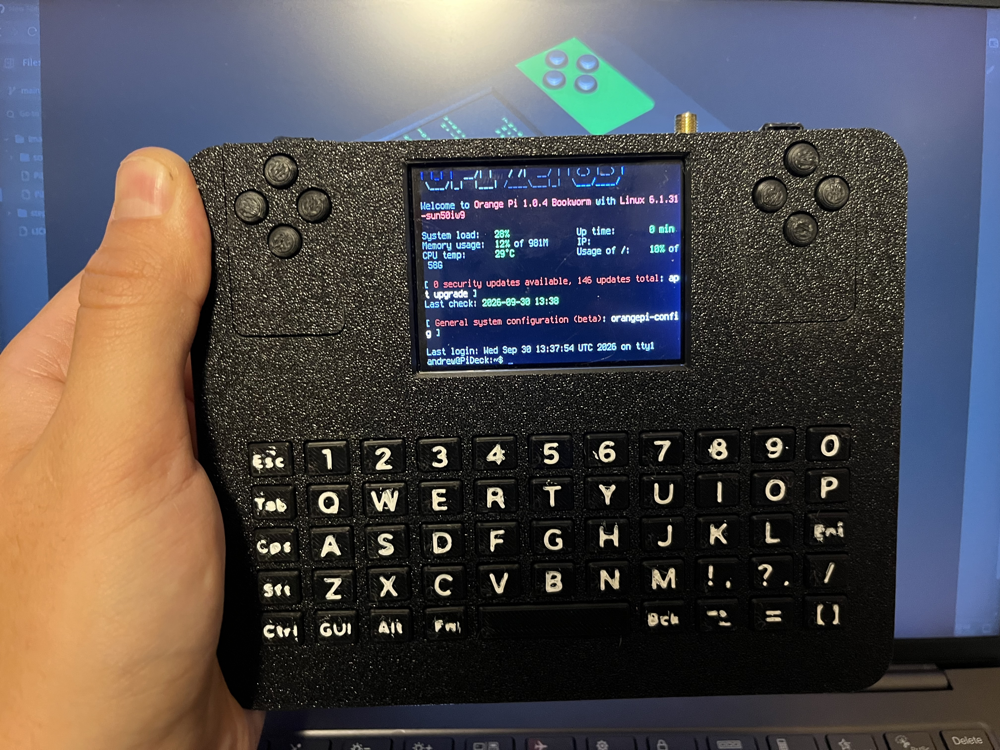

# Pi-Deck
**A Portable Linux PC**, perfect for testing!

## BOM

| Component | Link | Qty | Usage |
|-----------|------|-----| ------ |
|Orange Pi zero 3| [Aliexpress](https://www.aliexpress.com/item/1005005785695181.html?spm=a2g0o.order_list.order_list_main.17.3e471802RAXXQB)| 1| Main Brain |
|LG INR18650-MJ1 3400mAh| [Link](https://electronicmarket.ro/baterie-li-ion-originala-lg-inr18650-mj1-3400mah-10a-18650) | 4 | Batteries|
| TFT Display | [Aliexpress](https://www.aliexpress.com/item/1005012157261236.html?spm=a2g0o.order_list.order_list_main.11.3e471802RAXXQB)| 1 | Display|
| LORA Module | [Aliexpress](https://www.aliexpress.com/item/1005003038917144.html?spm=a2g0o.order_list.order_list_main.23.3e471802RAXXQB) | 1 | Long Range Comunication|
| Custom RP2040 Keyboad | [Github Repo]() | 1 | Control for PiDeck|
| UPS 15W 5V | [Link]() | 1 | Pass Through Charging|
| SMA Connector | [OptimusDigital]() | 2 | Antena connector for LORA and for future RTLSDR|
| Buttons | [Link]() | 10 | For Dpads|
|Battery Holders| [Link]() | 4 | Hold the baterry in case|
|ESP32-C3 SuperMini| [Link]() | 1 | Holds the Lora comunication and can be coded directly from PiDeck via UART|
| Wires | [Link]() | A lot | Wiring|
| Micro SD card | [Link]() | 1 | OS|
| Speaker | [link]() | 1 or 2 for stereo | Sound|
| USB Audio | [link]() | 1 | |
| Audio Amplifier | [Link]() | 1 | Aplifies the audio from USB Audio|

## How to Start

the assemble guide will be posted in the future, for now we can use the 3d visualisation of the device.

